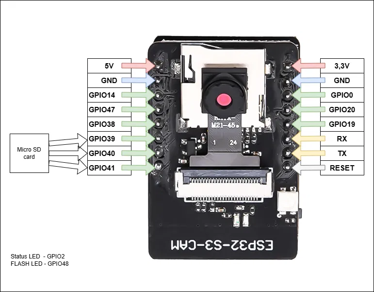

# Smart Wearable Navigation Aid for the Visually Impaired

A low-cost, wrist-mounted **embedded sensor-fusion system** that warns visually impaired users about
obstacles ahead, drops in the walking path (steps, curbs), and stairs, using short audio cues in a
single earbud and haptic pulses. Everything runs on-device: no cloud, no network.

> BS Computer Engineering capstone, St. Vincent's College Incorporated, Dipolog City.
> Proof-of-concept prototype tested in controlled environments. Not a certified medical or mobility device.



## What it does

| Hazard | Sensor | Feedback |
|---|---|---|
| Obstacle ahead (≤ 80 cm) | HC-SR04 ultrasonic | "Obstacle" + "Go left/right" + pulsing vibration |
| Drop / path discontinuity (step down, curb) | VL53L0X laser ToF, angled down | "Step down" + solid vibration |
| Which side is freer | Camera, left/center/right zone analysis | "Go left" / "Go right" |
| Ascending stairs *(experimental)* | Camera, horizontal-edge heuristic | "Stairs ahead" |
| Where hazards happened | Neo-6M GPS | logged to flash (CSV) |
| Distance to a landmark | GPS + Haversine, button press | "Cathedral" + "100 to 500 meters" |

The sensors don't vote on the same thing. Each one answers a different question (ahead? below? which
side? where?), and a fixed-priority rule set combines them. That makes this **Level 1 complementary
fusion**. See [docs/architecture.md](docs/architecture.md).

## Hardware

AIDEEPEN ESP32-S3-CAM (ESP32-S3-N16R8, GC2145) · HC-SR04 · VL53L0X · DFPlayer Mini + wired earbud ·
Neo-6M GPS · coin vibration motor · push button · 5 V power bank.
Full list in [docs/bom.md](docs/bom.md). Wiring is in [docs/pin-map.md](docs/pin-map.md).

## Repository layout

```
firmware/
  00_camera_test/          camera bring-up (GC2145, 320x240 RGB565)
  01_ultrasonic_test/      HC-SR04 accuracy, CSV output
  02_tof_test/             VL53L0X drop readings, CSV output
  03_audio_test/           DFPlayer tracks via Serial Monitor
  04_gps_test/             GPS fix + landmark coordinate averaging
  05_haptic_button_test/   vibration patterns + button
  navigation_aid/          integrated firmware (config.h = all pins & thresholds)
vision/
  zone_analysis.py         laptop prototype of the on-device camera logic (OpenCV)
  tests/                   unit tests + C-vs-Python equivalence test
tools/
  haversine.py             check landmark distances
  serial_logger.py         save device output during test runs
docs/                      architecture, pin map, BOM, as-built spec, testing protocol, dataset guide
data/templates/            CSV sheets for test trials and the usability survey
```

## Quick start

### 1. Arduino IDE setup
- Boards Manager: **esp32 by Espressif Systems**
- Board: **ESP32S3 Dev Module** · PSRAM: **OPI PSRAM** · Flash Size: **16MB** · USB CDC On Boot: **Disabled**
- Partition scheme: any scheme with a SPIFFS/LittleFS partition (e.g. *Default 4MB with spiffs*)
- Libraries (Library Manager): **Adafruit_VL53L0X**, **DFRobotDFPlayerMini**, **TinyGPSPlus**
- Serial Monitor: **115200** baud

### 2. Validate every part on its own first
Flash `firmware/00_…` through `05_…` one at a time on a breadboard. Pass criteria are in
[docs/testing-protocol.md](docs/testing-protocol.md). Don't combine parts that haven't passed their own test.

### 3. Prepare the audio SD card
Put 13 short MP3 clips in `/mp3/` on the DFPlayer's card. Names are listed in [docs/audio-tracks.md](docs/audio-tracks.md).

### 4. Set landmarks
Stand at each landmark with `04_gps_test`, type `a`, and paste the printed line into
`firmware/navigation_aid/config.h`. The placeholders are `0.0, 0.0` and get skipped until you replace them.

### 5. Flash the integrated firmware
Open `firmware/navigation_aid/navigation_aid.ino`. Features can be switched off one by one in `config.h`
(`ENABLE_CAMERA`, `ENABLE_TOF`, …). At boot, **hold your arm in its normal walking pose**
while it says "Calibrating". That reading becomes the floor baseline.

Serial commands: `s` status · `d` dump hazard log (CSV) · `c` clear log · `r` recalibrate floor.

### 6. Tune the camera logic on a laptop (optional)
```bash
pip install -r vision/requirements.txt
python vision/zone_analysis.py --webcam 0          # live
python vision/zone_analysis.py --folder photos --csv results.csv
python -m pytest vision/tests -q                   # includes C-vs-Python equivalence check
```
`vision/zone_analysis.py` and `firmware/navigation_aid/camera_zones.h` use the same algorithm and
thresholds. If you tune one, change the other too. The equivalence test catches drift.

## Limitations

- VL53L0X is **single-point**. It catches path discontinuities along its beam, not every hole. Arm swing
  can cause false alarms.
- Camera zone analysis measures clutter (edge density). It doesn't recognise objects.
- Ascending stair detection is a **heuristic** and still experimental. A trained `upstairs`/`downstairs` model
  (Roboflow → TFLite Micro / Edge Impulse) is the planned upgrade.
- GPS gives **position, not heading**. It can tell distance to a landmark, but it can't give turn-by-turn directions.
- Tested only in controlled campus environments.

## Team

- **Dave Alolod**: hardware & firmware lead
- **Renz Jay C. Nalzaro**: manuscript
- **Rodel A. Juguilon**: documentation, dataset collection, respondent coordination

Adviser: **Engr. Luthermie B. Manago**

## License

MIT. See [LICENSE](LICENSE).
