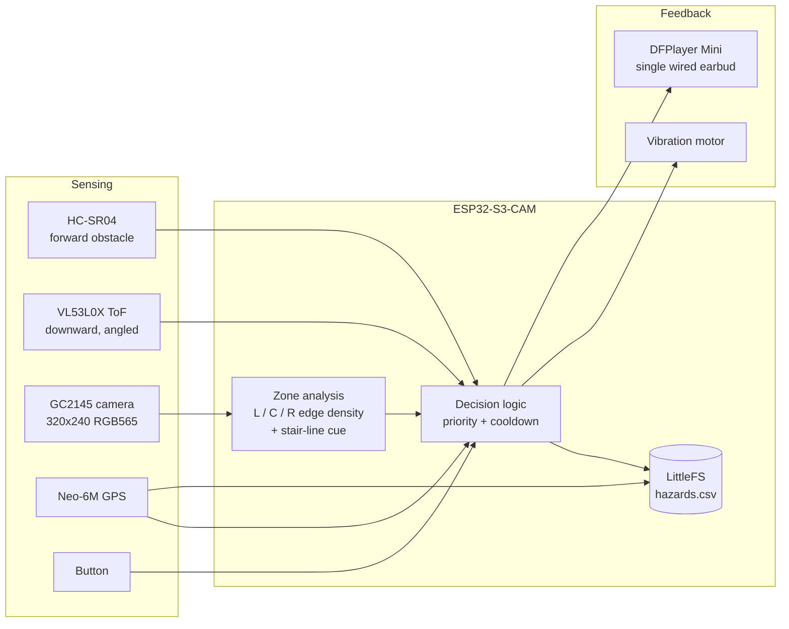

# System architecture

**Classification:** standalone embedded wearable — an *embedded sensor-fusion system*. There is no network
connectivity, so it is **not** an IoT device. All processing runs on the ESP32-S3.

## Block diagram

## Sensor fusion model — Level 1, complementary

Each sensor answers a **different question** along a different sensing axis; the decision logic combines them
with fixed thresholds and a fixed priority. This is deliberately *not* Kalman filtering or probabilistic
fusion — it is threshold-based reactive logic, which is the academically defensible description.

| Sensor | Question it answers | Output used |
|---|---|---|
| HC-SR04 | Is something **ahead**? | distance (cm) |
| VL53L0X | Did the **floor drop away**? | distance vs. calibrated baseline (mm) |
| Camera | Which **side** is freer? Are there **stair-like lines**? | edge density per zone, line count |
| Neo-6M | **Where** did it happen? How far is a landmark? | lat/lon, Haversine distance |

## Decision priority

1. **Drop / path discontinuity** — ToF reading > baseline + 150 mm (or out of range) for 3 consecutive
   samples → "Step down" + solid vibration. Highest priority: fall risk.
2. **Near obstacle** — HC-SR04 ≤ 80 cm → "Obstacle", then "Go left"/"Go right" from the camera zones.
3. **Stairs cue (experimental)** — ≥ 3 horizontal edge bands in the center zone *and* something within
   2.5 m ahead → "Stairs ahead".

Haptics run continuously and independently: pulse gap shrinks as the obstacle gets closer (≤ 150 cm), like a
car parking sensor. Audio has a 1.5 s cooldown so alerts never pile up.

## Timing

| Task | Period |
|---|---|
| HC-SR04 ping | 70 ms |
| VL53L0X read | 50 ms |
| Camera frame + zone analysis | 250 ms (~4 FPS) |
| GPS NMEA parse | every loop |
| Audio cooldown | 1500 ms |

## Honest limits (say these before the panel does)

- The VL53L0X is a **single-point** sensor: it detects a path discontinuity directly under/ahead of the wrist,
  not arbitrary holes. Arm swing can cause false alarms — debounce + calibration reduce, not remove, this.
- Camera zone analysis uses **edge density as a proxy for clutter**. It picks a *freer side*; it does not
  recognise objects. It only speaks when the HC-SR04 has already confirmed an obstacle.
- The stair cue is a **heuristic** for ascending stairs, validated only in controlled settings. The Roboflow
  model (`upstairs` / `downstairs`) is the planned upgrade path.
- GPS gives **position, not heading**. Without a magnetometer the device can say *how far* a landmark is,
  not *which direction to turn*.
